# Pertemuan 5: Aplikasi Pertama dan Widget Dasar Flutter

**NIM**: 2341720116  
**Nama**: Hanif Faishal Hilmi

-----

## 📝 Praktikum #05 | Aplikasi Pertama dan Widget Dasar Flutter

---

### Praktikum 1: Praktikum 1: Membuat Project Flutter Baru

#### Langkah 1
Buka VS Code, lalu tekan tombol **Ctrl + Shift + P** maka akan tampil Command Palette, lalu ketik **Flutter**. Pilih **New Application Project**.

#### Langkah 2:
Kemudian buat folder **sesuai style** laporan praktikum yang Anda pilih. Disarankan pada folder dokumen atau desktop atau alamat folder lain yang tidak terlalu dalam atau panjang. Lalu pilih **Select a folder to create the project in**.

#### Langkah 3:
Buat nama project flutter **hello_world** seperti berikut, lalu tekan **Enter**. Tunggu hingga proses pembuatan project baru selesai.

#### Langkah 4:
Jika sudah selesai proses pembuatan project baru, pastikan tampilan seperti berikut. Pesan akan tampil berupa "**Your Flutter Project is ready!**" artinya Anda telah berhasil membuat project Flutter baru.

---

### Praktikum 2: Menghubungkan Perangkat Android atau Emulator

#### Mengaktifkan proses debug USB

##### VS Code
1. Di perangkat Android, ketuk **Settings > About phone**.

2. Ketuk **Build number** tujuh kali.

3. Jika diminta, masukkan sandi atau PIN perangkat. Anda tahu Anda telah berhasil saat melihat pesan **You are now a developer!**.

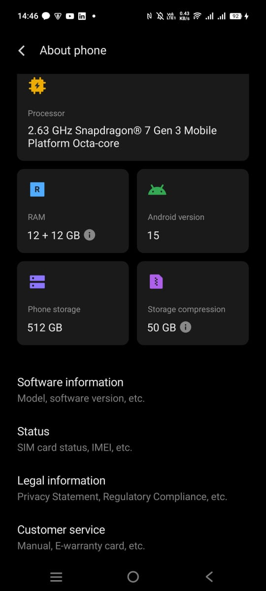

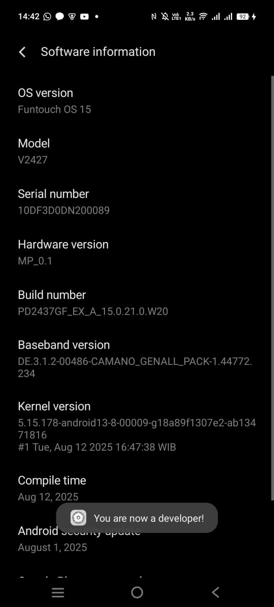

4. Kembali ke **Settings**, lalu ketuk *System > Developer options*.

5. Jika Anda tidak melihat **Developer options**, ketuk **Advanced options**.

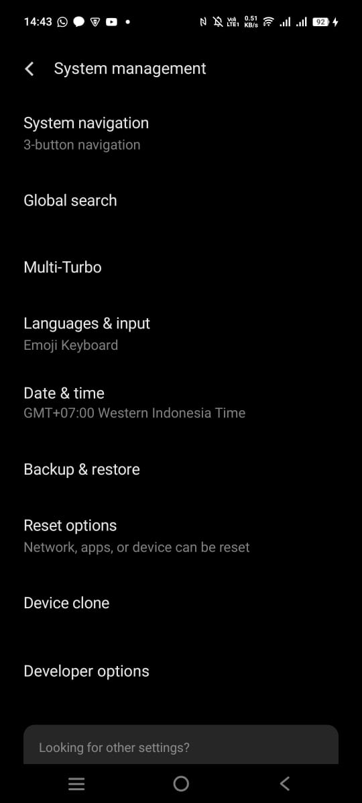

6. Ketuk Opsi developer, lalu ketuk tombol Proses debug USB untuk mengaktifkannya.

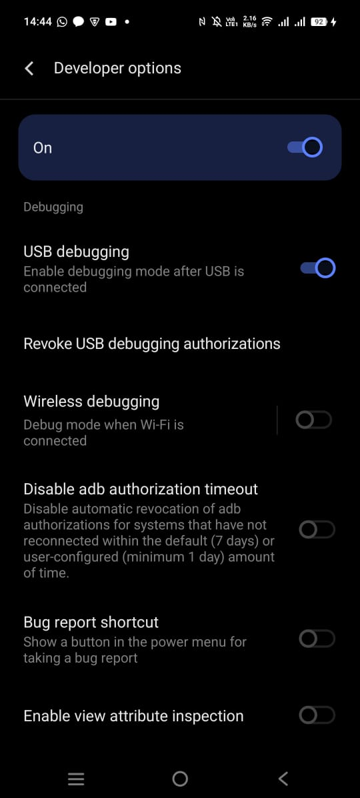

---

### Praktikum 2: Menghubungkan Perangkat Android atau Emulator

#### Langkah 1

Login ke akun GitHub Anda, lalu buat repository baru dengan nama "flutter-fundamental-part1"

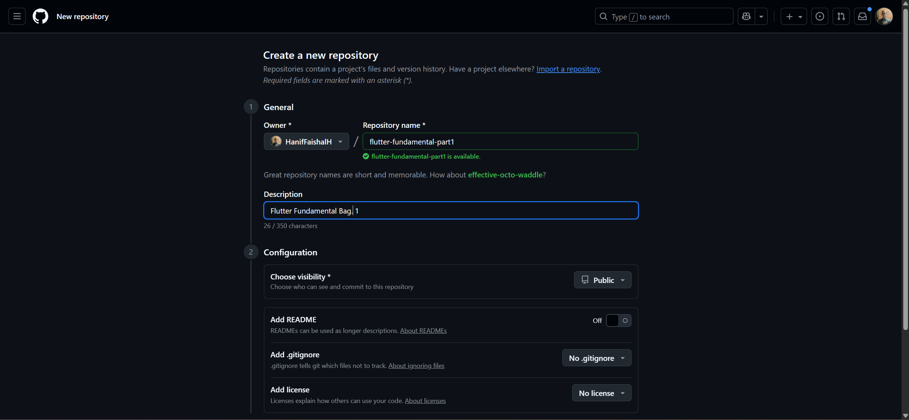

#### Langkah 2

Login ke akun GitHub Anda, lalu buat repository baru dengan nama "flutter-fundamental-part1"

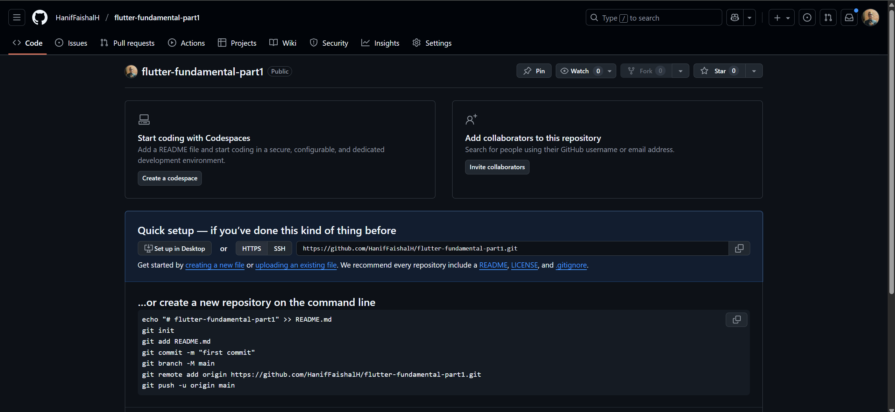

#### Langkah 3

Kembali ke VS code, project flutter hello_world, buka terminal pada menu Terminal > New Terminal. Lalu ketik perintah berikut untuk inisialisasi git pada project Anda.

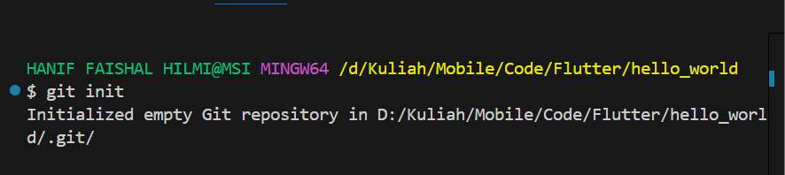

#### Langkah 4:
Pilih menu Source Control di bagian kiri, lalu lakukan stages (+) pada file .gitignore untuk mengunggah file pertama ke repository GitHub.

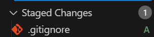

#### Langkah 5:
Beri pesan commit "tambah gitignore" lalu klik Commit (✔)

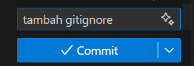

#### Langkah 6:
Lakukan push dengan klik bagian menu titik tiga > Push

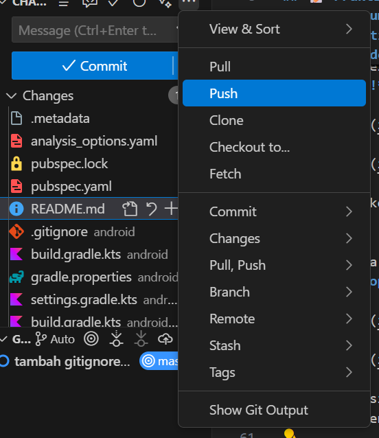

#### Langkah 7:
Di pojok kanan bawah akan tampil seperti gambar berikut. Klik "Add Remote"

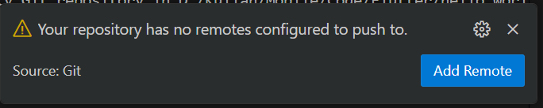

#### Langkah 8:
Salin tautan repository Anda dari browser ke bagian ini, lalu klik Add remote

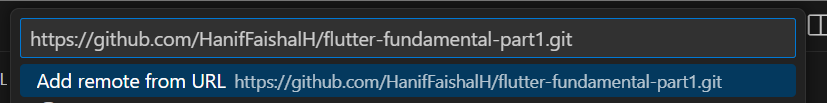

Setelah berhasil, tulis remote name dengan "origin"

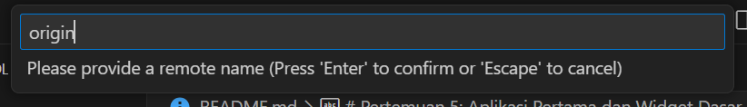

#### Langkah 9:
Lakukan hal yang sama pada file README.md mulai dari Langkah 4. Setelah berhasil melakukan push, masukkan username GitHub Anda dan password berupa token yang telah dibuat (pengganti password konvensional ketika Anda login di browser GitHub). Reload halaman repository GitHub Anda, maka akan tampil hasil push kedua file tersebut seperti gambar berikut.

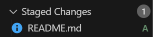
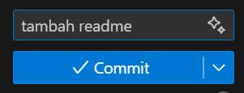
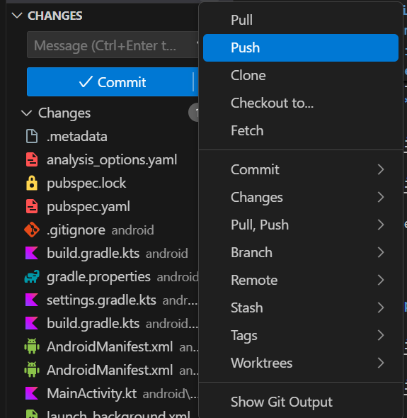
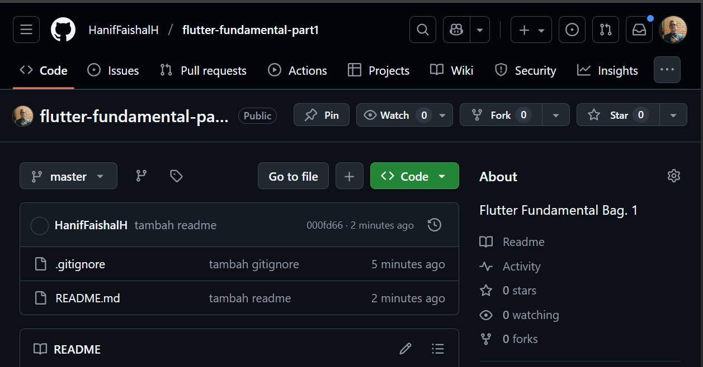

#### Langkah 10:
Lakukan push juga untuk semua file lainnya dengan pilih Stage All Changes. Beri pesan commit "project hello_world". Maka akan tampil di repository GitHub Anda seperti berikut.

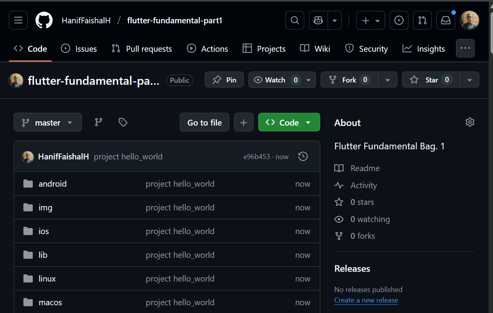

#### Langkah 11:
Kembali ke VS Code, ubah platform di pojok kanan bawah ke emulator atau device atau bisa juga menggunakan browser Chrome. Lalu coba running project hello_world dengan tekan F5 atau Run > Start Debugging. Tunggu proses kompilasi hingga selesai, maka aplikasi flutter pertama Anda akan tampil seperti berikut.

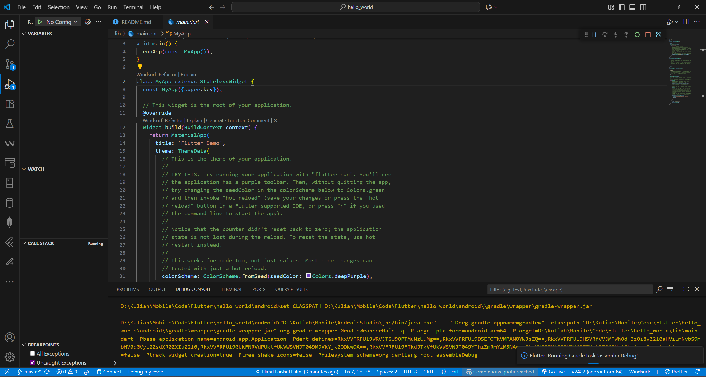

#### Langkah 12:
Silakan screenshot seperti pada Langkah 11, namun teks yang ditampilkan dalam aplikasi berupa nama lengkap Anda. Simpan file screenshot dengan nama 01.png pada folder images (buat folder baru jika belum ada) di project hello_world Anda. Lalu ubah isi README.md seperti berikut, sehingga tampil hasil screenshot pada file README.md. Kemudian push ke repository Anda.

