# Pertemuan 5: Aplikasi Pertama dan Widget Dasar Flutter

**NIM**: 2341720116
**Nama**: Hanif Faishal Hilmi

---

## 📝 Praktikum #05 | Aplikasi Pertama dan Widget Dasar Flutter

---

### Praktikum 1: Membuat Project Flutter Baru

**Langkah 1**
Buka VS Code, lalu tekan **Ctrl + Shift + P**, ketik **Flutter**, pilih **New Application Project**.

**Langkah 2**
Buat folder sesuai style laporan, lalu pilih **Select a folder to create the project in**.

**Langkah 3**
Buat nama project `hello_world`, lalu tekan **Enter**. Tunggu hingga selesai.

**Langkah 4**
Jika berhasil, akan muncul pesan **"Your Flutter Project is ready!"**.

---

### Praktikum 2: Menghubungkan Perangkat Android atau Emulator

#### VS Code

**Mengaktifkan proses debug USB**

1. Di perangkat Android, buka **Settings > About phone**.
2. Ketuk **Build number** tujuh kali hingga muncul pesan **You are now a developer!**.

3. Kembali ke **Settings > System > Developer options**.
4. Aktifkan **USB Debugging**.

#### Android Studio

1. Di Android Studio, klik Tools > SDK Manager. Dialog Preferences > Appearance & Behavior > System Settings > Android SDK akan terbuka.

2. Klik tab SDK Tools.

3. Pilih Google USB Driver, lalu klik OK.

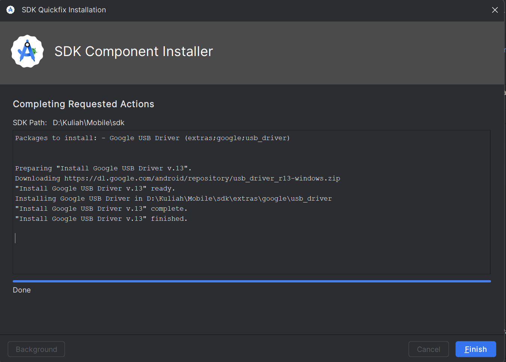
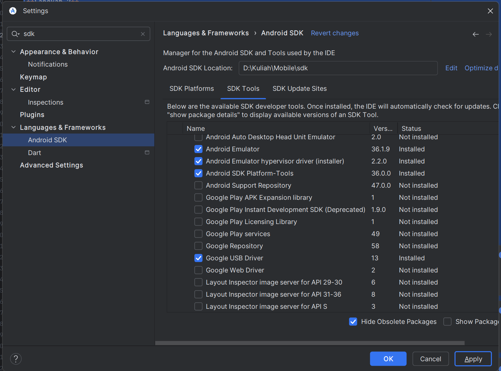

---

#### Menjalankan aplikasi di perangkat Android menggunakan kabel

1. Sambungkan perangkat Android ke komputer menggunakan kabel USB. Dialog yang meminta Anda mengizinkan proses debug USB akan muncul di perangkat.

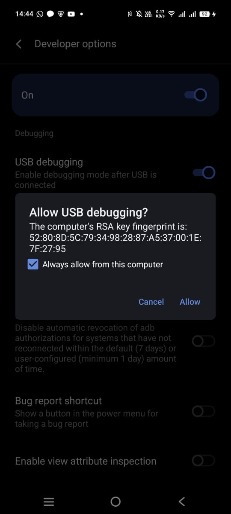

2. Pilih kotak centang Always allow from this computer, lalu ketuk OK.

3. Di Android Studio di komputer, pastikan perangkat Anda dipilih di menu dropdown. Klik Ini adalah ikon Run Android Studio.

### Praktikum 3: Membuat Repository GitHub dan Laporan Praktikum

**Langkah 1**
Login GitHub, buat repository baru bernama **flutter-fundamental-part1**.

**Langkah 2**
Repository berhasil dibuat.

**Langkah 3**
Di VS Code, buka terminal lalu inisialisasi git.

**Langkah 4**
Pilih menu Source Control, lalu stage file `.gitignore`.

**Langkah 5**
Commit dengan pesan *"tambah gitignore"*.

**Langkah 6**
Push project ke GitHub.

**Langkah 7**
Tambahkan remote repository.

**Langkah 8**
Masukkan URL repository dan beri nama remote `origin`.

**Langkah 9**
Push file `README.md`, gunakan token GitHub untuk login.

**Langkah 10**
Stage All Changes, commit dengan pesan *"project hello\_world"*, lalu push.

**Langkah 11**
Jalankan project di emulator atau Chrome.

**Langkah 12**
Screenshot hasil dengan teks nama lengkap Anda. Simpan sebagai `01.png` di folder `images`. Tambahkan ke `README.md` lalu push.

---

### Praktikum 4: Menerapkan Widget Dasar

**Langkah 1: Text Widget**
Buat folder `basic_widgets` di dalam `lib`, lalu file `text_widget.dart`. Import ke `main.dart`.

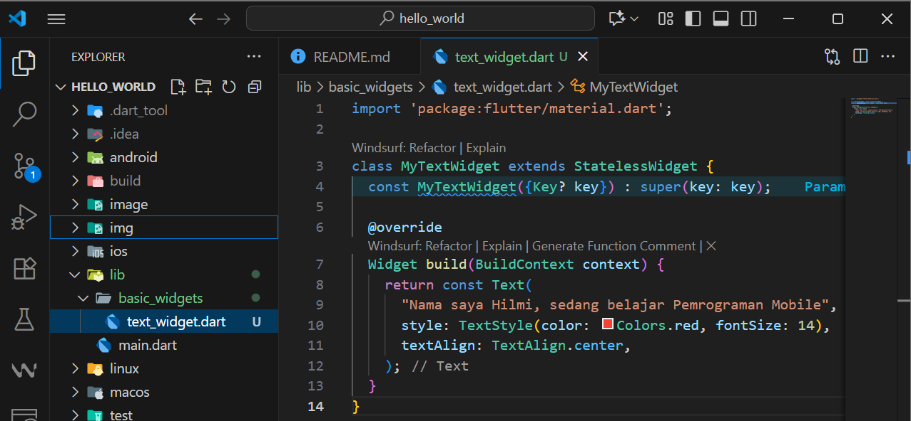
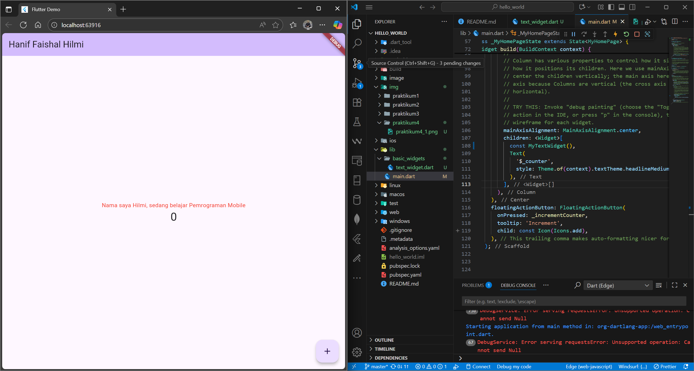

**Langkah 2: Image Widget**
Buat file `image_widget.dart` dan tambahkan asset pada `pubspec.yaml`.

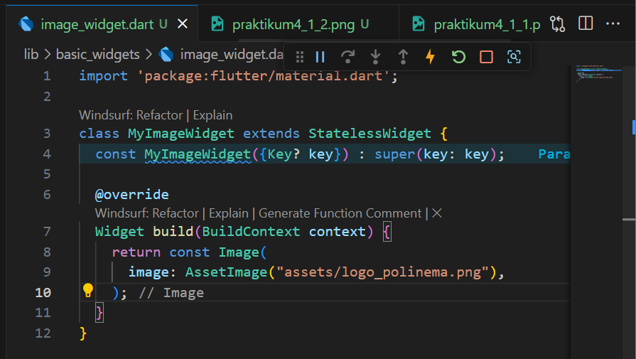
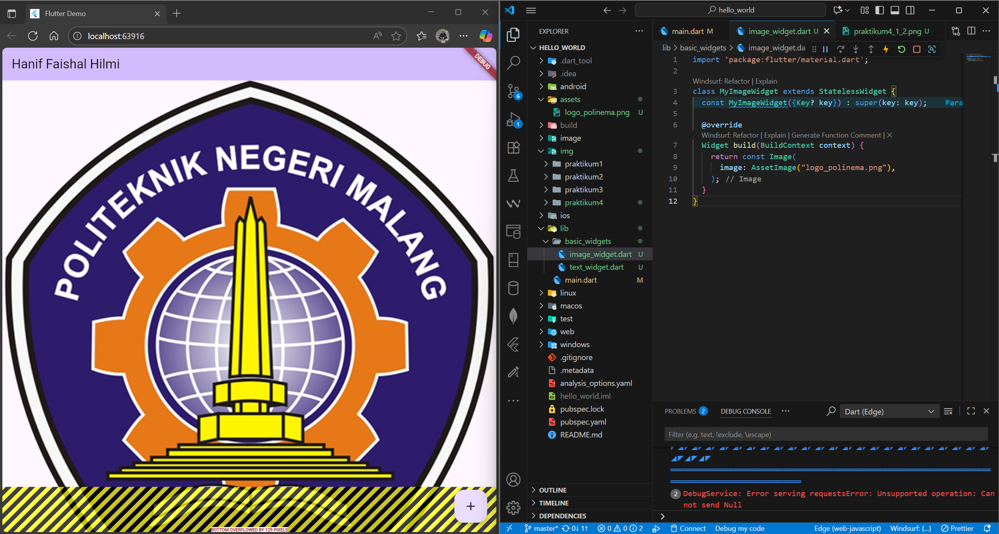

---

### Praktikum 5: Menerapkan Widget Material Design dan iOS Cupertino

**Langkah 1: Cupertino Button dan Loading Bar**
Buat file `loading_cupertino.dart`.

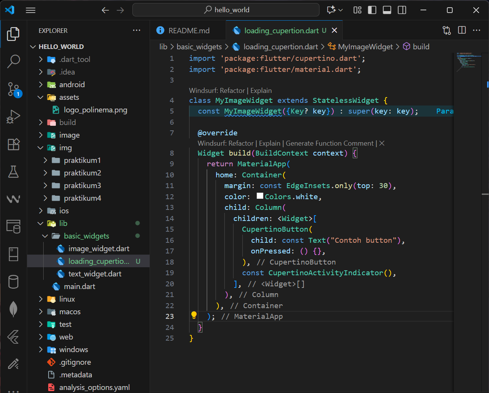

**Langkah 2: Floating Action Button (FAB)**
Buat file `fab_widget.dart`.

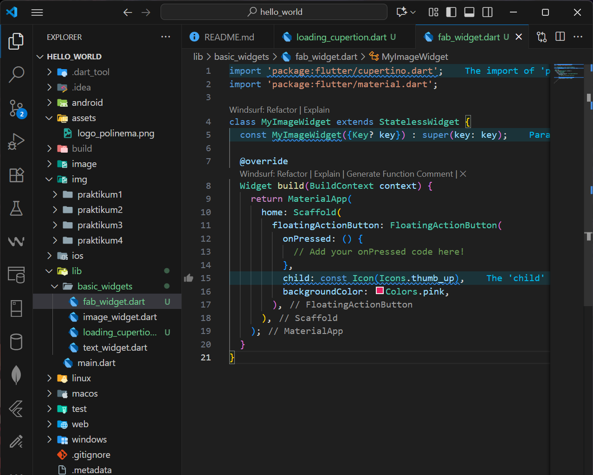

**Langkah 3: Scaffold Widget**
Gunakan `Scaffold` untuk tata letak Material Design.

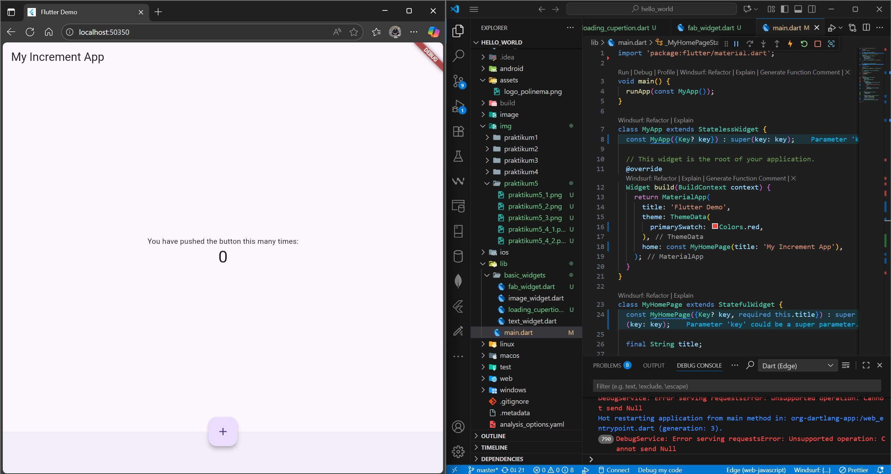

**Langkah 4: Dialog Widget**
Gunakan `AlertDialog` atau `SimpleDialog`.

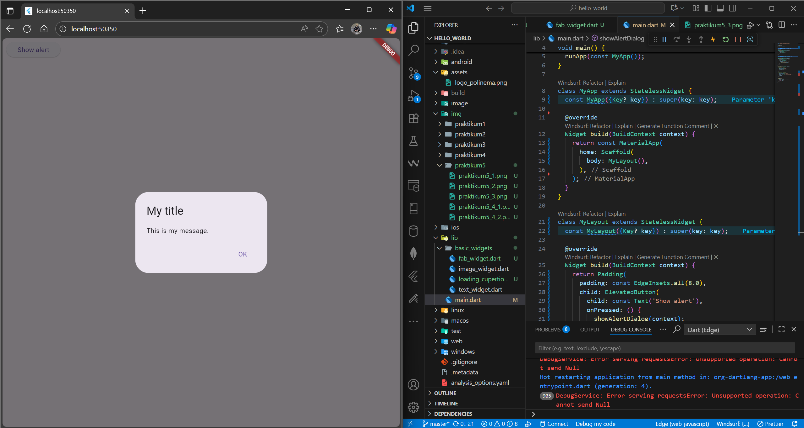

**Langkah 5: Input dan Selection Widget**
Contoh penggunaan `TextField`.

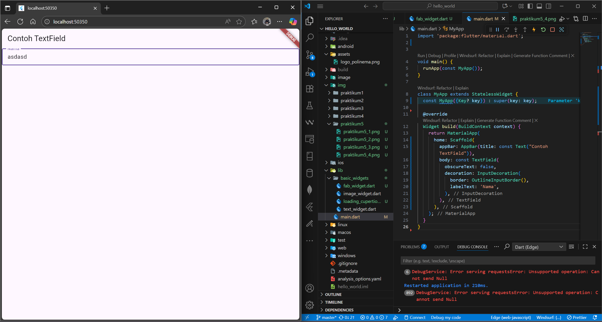

**Langkah 6: Date and Time Pickers**
Gunakan widget pemilih tanggal dan waktu.

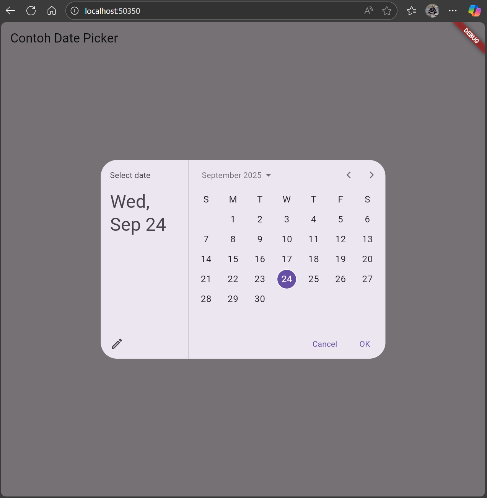
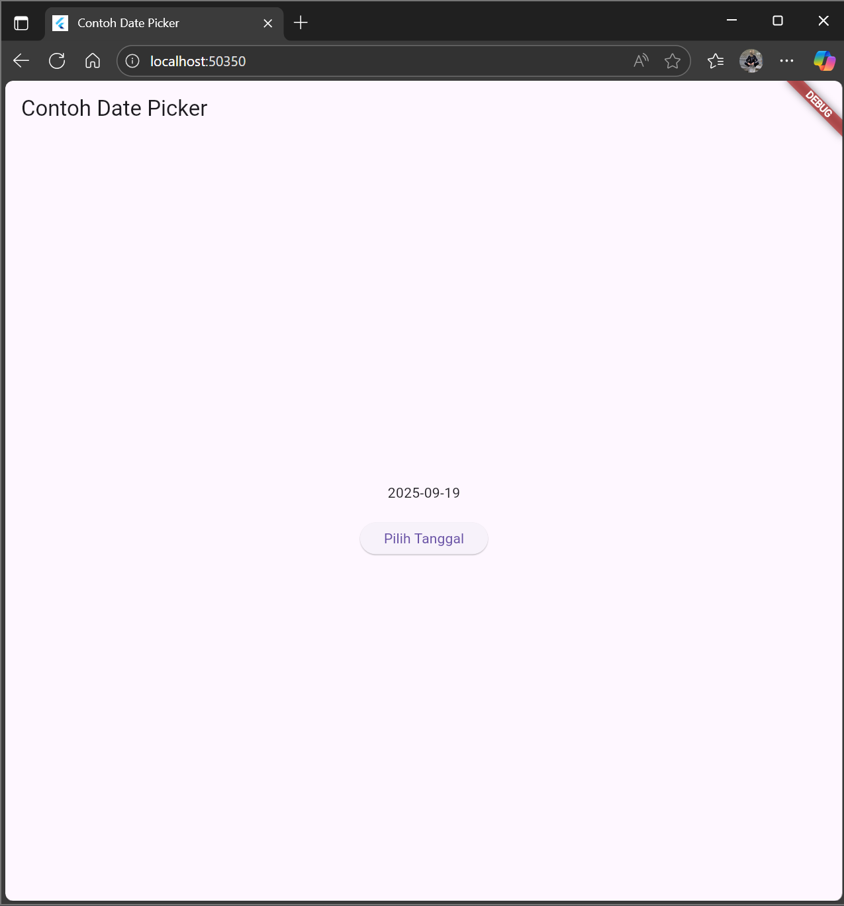

---

