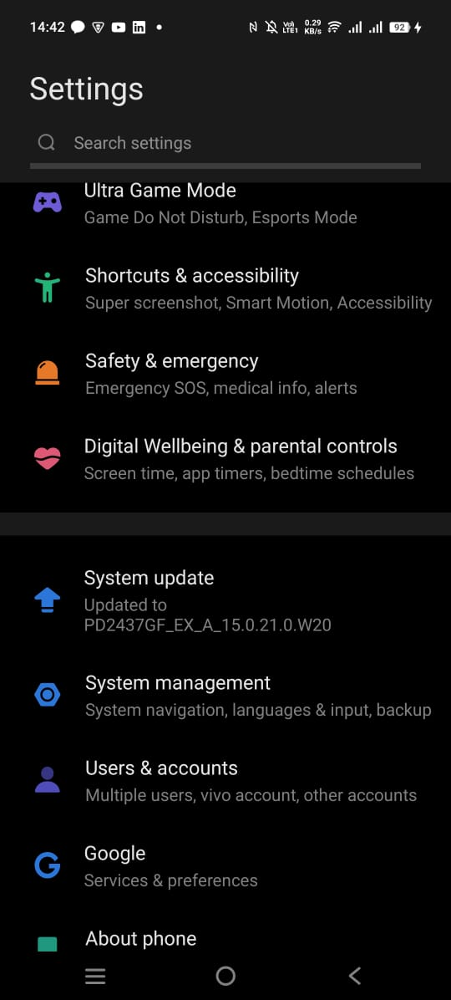

# Pertemuan 5: Aplikasi Pertama dan Widget Dasar Flutter

**NIM**: 2341720116  
**Nama**: Hanif Faishal Hilmi

-----

## 📝 Praktikum #05 | Aplikasi Pertama dan Widget Dasar Flutter

---

### Praktikum 1: Praktikum 1: Membuat Project Flutter Baru

#### Langkah 1
Buka VS Code, lalu tekan tombol **Ctrl + Shift + P** maka akan tampil Command Palette, lalu ketik **Flutter**. Pilih **New Application Project**.

#### Langkah 2:
Kemudian buat folder **sesuai style** laporan praktikum yang Anda pilih. Disarankan pada folder dokumen atau desktop atau alamat folder lain yang tidak terlalu dalam atau panjang. Lalu pilih **Select a folder to create the project in**.

#### Langkah 3:
Buat nama project flutter **hello_world** seperti berikut, lalu tekan **Enter**. Tunggu hingga proses pembuatan project baru selesai.

#### Langkah 4:
Jika sudah selesai proses pembuatan project baru, pastikan tampilan seperti berikut. Pesan akan tampil berupa "**Your Flutter Project is ready!**" artinya Anda telah berhasil membuat project Flutter baru.

---

### Praktikum 2: Menghubungkan Perangkat Android atau Emulator

#### Mengaktifkan proses debug USB

##### VS Code
1. Di perangkat Android, ketuk **Settings > About phone**.

2. Ketuk **Build number** tujuh kali.

3. Jika diminta, masukkan sandi atau PIN perangkat. Anda tahu Anda telah berhasil saat melihat pesan **You are now a developer!**.

4. Kembali ke **Settings**, lalu ketuk *System > Developer options*.

5. Jika Anda tidak melihat **Developer options**, ketuk **Advanced options**.

6. Ketuk Opsi developer, lalu ketuk tombol Proses debug USB untuk mengaktifkannya.

---

### Praktikum 2: Menghubungkan Perangkat Android atau Emulator

#### Langkah 1

Login ke akun GitHub Anda, lalu buat repository baru dengan nama "flutter-fundamental-part1"

